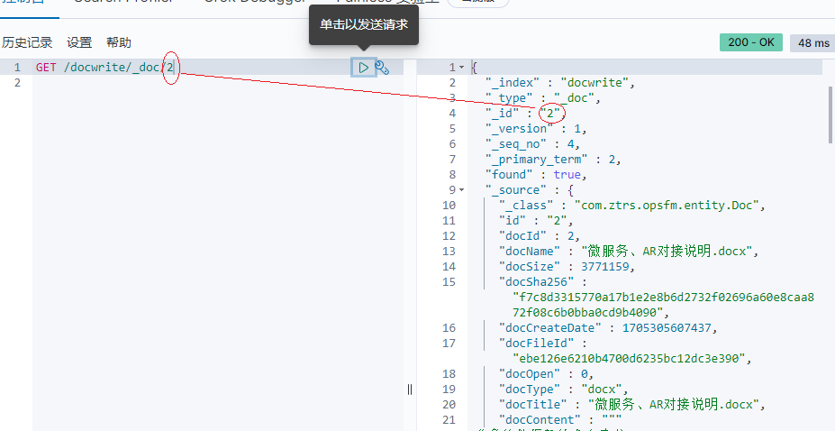

## 文档元数据

​	**索引(index)**类似于关系型数据库里的“数据库”——它是我们存储和索引关联数据的地方。**索引只是一个把一个或多个分片分组在一起的逻辑空间。**类似于数据库。

索引名。这个名字必须是全部小写，不能以下划线开头，不能包含逗号


~~**类型(type)**都有自己的**映射(mapping)**或者结构定义，就像传统数据库表中的列一样。所有类型下的文档被存储在同一个索引下，但是类型的**映射(mapping)**会告诉Elasticsearch不同的文档如何被索引。~~

这个概念在7.0以后版本可以不用关注，一个索引只能有一个类型

类型名可以是大写或小写，不能包含下划线或逗号。

**id**仅仅是一个字符串，它与`_index`和`_type`组合时，就可以在Elasticsearch中唯一标识一个文档。当创建一个文档，你可以自定义`_id`，也可以让Elasticsearch帮你自动生成。

还有一些其它的元数据，我们将在Mapping段落探讨


##### 基本操作


检索文档

返回结果字段含义

|      |      |
| ---- | ---- |
|      |      |
|      |      |
|      |      |


通过文档坐标信息检索  索引-类型-文档id

GET /docwrite/_doc/2  



查询所有文档，默认分页前十条

GET /docwrite/_doc/_search等同于/docwrite/_search


按条件搜索（查询docName**包含**“微服务、AR对接说明.docx”）

使用参数***q=***

GET /docwrite/_doc/_search?q=docName:微服务、AR对接说明.docx


使用***DSL***语句查询

```DSL
GET /docwrite/_search
{
  "query":{
    "match": {
      "docName": "微服务、AR对接说明.docx"
    }
  }
}
```

返回结果与上面一致

#分页 跳过前三条 显示后2条

```
GET /doc*,kib*/_search?size=2&from=3


GET /doc*,kib*/_search
{
  "from": 3, "size": 2
}


POST /doc*,kib*/_search
{
  "from": 3, "size": 2
}
```

区间过滤器

```
#按大小过滤
GET /docwrite/_search
{
  "query": {
    "bool":{
      "filter": [
       { "range":{"docSize":{"lt":3671160}}}
      ]
    }
  }
}
```

短语搜索

```
GET /docwrite/_search
{
  "query":{
    "match_phrase": {
      "docContent": "微服务"
    }
  }
}
微服务作为一个整体去搜索，不会去分词成更细粒度
```

高亮搜索结果

```
GET /docwrite/_search
{
  "query":{
    "match": {
      "docName": "微服务"
    }
  },
  "highlight": {
    "fields": {"docName": {}}
  }
}
```


聚合操作（text类型默认不支持聚合和排序操作）


聚合操作


聚合操作（过滤后聚合）

```
#过滤后聚合
GET /docwrite/_search
{
  "query":{
    "match": {
      "docName": "软件"
    }
  },
  "aggs": {
    "doc_types": {
      "terms": {
        "field": "docType",
        "size": 10
      }
    }
  }
}
```


#删除文档 文档不存在时返回状态码404，成功找到并删除返回200
#删除一个文档也不会立即从磁盘上移除，它只是被标记成已删除。Elasticsearch将会在你之后添加更多索引的时候才会在后台进行删除内容的清理。
DELETE /docwrite/_doc/404
DELETE /docwrite/_doc/66

#创建文档
#不覆盖 已存在时返回状态码409，创建成功返回状态码201
#1.使用op_type

```
PUT /docwrite/_doc/6?op_type=create
{
  "docName":"123"
}_
```


#2.使用/_create做为端点

```
PUT /docwrite/_doc/6/_create
{
  "docName":"123"
}
PUT /docwrite/_doc/66/_create
{
  "docName":"123"
}
```

#并发控制，更新时使用if_seq_no与if_primary_term，version已不支持

```
PUT /docwrite/_doc/test/_create
{
  "docName":"123"
}

PUT /docwrite/_doc/test?version=1
{
  "docName":"1234"
}

PUT /docwrite/_doc/test?if_seq_no=18&if_primary_term=1
{
  "docName":"1234"
}
```

------

文档局部更新 

#使用**doc**作为json的key

```
DELETE /docwrite/_doc/test_update
PUT /docwrite/_doc/test_update/_create
{
  "doc1":{
    "views": 0
  }
}

POST /docwrite/_update/test_update
{
  "doc":{
    "doc1":{
      "views": 2
  }
  }
}

GET /docwrite/_doc/test_update
```

#使用Groovy脚本

```
POST /docwrite/_update/test_update
{
  "script" : "ctx._source.doc1.views+=1"
}
```

#使用upsert更新不存在的文档

```
GET /docwrite/_doc/test_update_NE
POST /docwrite/_update/test_update_NE
{
  "script" : "ctx._source.doc1.views+=1",
  "upsert":{
    "doc1":{
      "views":99
    }
  }
}
```

------

检索多个文档

```
POST /_mget
{
   "docs" : [
      {
         "_index" : "docwrite",
         "_id" :    12,
         "_source": ["docName","docType"]
      },
      {
         "_index" : "docwrite",
         "_id" :    11,
         "_source": "docName"
      }
   ]
}
多个条件的检索互不影响，返回结果正常显示
{
  "docs" : [
    {
      "_index" : "docwrite",
      "_type" : "_doc",
      "_id" : "12",
      "_version" : 1,
      "_seq_no" : 6,
      "_primary_term" : 1,
      "found" : true,
      "_source" : {
        "docName" : "ISP软件需求说明书(改进优化)_V1.3.7.6.docx",
        "docType" : "docx"
      }
    },
    {
      "_index" : "docwrite",
      "_type" : "_doc",
      "_id" : "110",
      "found" : false
    }
  ]
}

```

------

##### 分词

标记化和标准化的过程叫做**分词(analysis)**

- 首先，标记化一个文本块为适用于倒排索引单独的**词(term)**
- 然后标准化这些词为标准形式，提高它们的“可搜索性”或“查全率”

1. 首先字符串经过**字符过滤器(character filter)**，它们的工作是在标记化前处理字符串。字符过滤器能够去除HTML标记，或者转换`"&"`为`"and"`。
2. 下一步，**分词器(tokenizer)**被标记化成独立的词。**一个简单的**分词器(tokenizer)**可以根据空格或逗号将单词分开。
3. 每个词都通过所有**标记过滤(token filters)**，它可以修改词（例如将`"Quick"`转为小写），去掉词（例如停用词像`"a"`、`"and"`、`"the"`等等），或者增加词（例如同义词像`"jump"`和`"leap"`）

分词器

切分每个文档字段为单独的单词（我们把它们叫做**词(terms)或者表征(tokens)**），把所有的唯一词放入列表并排序

[分词器](https://www.elastic.co/guide/en/elasticsearch/reference/current/analysis-overview.html)

#查看分词器分词效果

```
GET /_analyze
{
  "analyzer": "ik_max_word",
  "text": ["微服务、AR对接说明.docx"]
}
```

ik_smart是一种智能分词器，它会尽量将句子分成意义合理的词语，适合处理一般的搜索需求。

ik_max_word则是一种细粒度分词器，它会尽可能多地将句子分成单个词语，适合需要更精细分词的场景。

------

##### 映射

[Mapping](https://www.elastic.co/guide/en/elasticsearch/reference/current/explicit-mapping.html)

​	[字段类型](https://www.elastic.co/guide/en/elasticsearch/reference/current/mapping-types.html)

###### 动态映射

当索引一个包含新字段的文档——一个之前没有的字段——Elasticsearch将使用动态映射基于JSON的基本数据类型猜测字段类型

#查看索引映射信息
GET /docwrite/_mapping

###### 自定义字段映射

多数情况下基本数据类型已经能够满足，但你也会经常需要自定义一些特殊类型（fields），特别是字符串字段类型。 自定义类型可以使你完成以下几点：

- 区分全文（full text）字符串字段和准确字符串字段（译者注：就是分词与不分词，全文的一般要分词，准确的就不需要分词，比如『中国』这个词。全文会分成『中』和『国』，但作为一个国家标识的时候我们是不需要分词的，所以它就应该是一个准确的字符串字段）。
- 使用特定语言的分析器（译者注：例如中文、英文、阿拉伯语，不同文字的断字、断词方式的差异）
- 优化部分匹配字段
- 指定自定义日期格式（译者注：这个比较好理解,例如英文的 `Feb,12,2016` 和 中文的 `2016年2月12日`）
- 以及更多