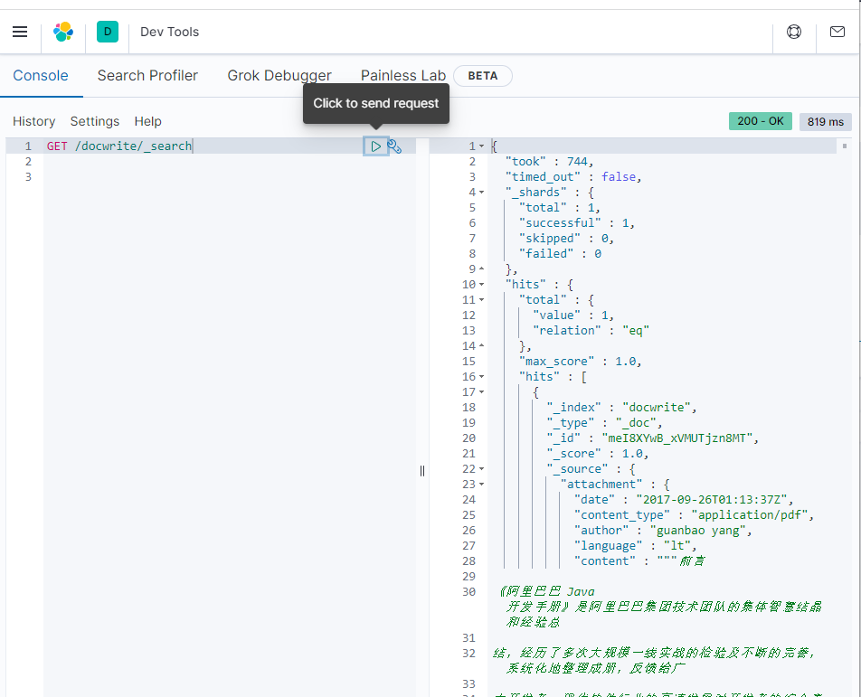

#### 1.安装插件

ingest-attachment，[点击下载]( https://artifacts.elastic.co/downloads/elasticsearch-plugins/ingest-attachment/ingest-attachment-7.9.3.zip.)

```sh
bin/elasticsearch-plugin install file:///data/ingest-attachment-7.9.0.zip
```

#### 2.定义文本抽取管道

对入库文档的指定字段作为文档文件进行文本抽取



```

PUT /_ingest/pipeline/attachment
{
  "description": "Extract attachment information",
  "processors": [
    {
      "attachment": {
        "field": "content",
        "ignore_missing": true
      }
    },
    {
      "remove": {
        "field": "content"
      }
    }
  ]
}
```

返回报错

```
{
  "error" : {
    "root_cause" : [
      {
        "type" : "parse_exception",
        "reason" : "No processor type exists with name [attachment]",
        "processor_type" : "attachment"
      }
    ],
    "type" : "parse_exception",
    "reason" : "No processor type exists with name [attachment]",
    "processor_type" : "attachment"
  },
  "status" : 400
}
```

看来是插件没生效，安装插件后es没有重启，重启一下试试，好了

```
{
  "acknowledged" : true
}

```

#### 3.安装分词插件

[下载地址](https://github.com/medcl/elasticsearch-analysis-ik/releases?page=8)，跟上面一样安装，安装后重启

#### 4.建立文档结构映射

```bash
PUT /docwrite
{
  "mappings": {
    "properties": {
      "id":{
        "type": "keyword"
      },
      "name":{
        "type": "text",
        "analyzer": "ik_max_word"
      },
      "type":{
        "type": "keyword"
      },
      "attachment": {
        "properties": {
          "content":{
            "type": "text",
            "analyzer": "ik_smart"
          }
        }
      }
    }
  }
}
```

成功后返回

```
{
  "acknowledged" : true,
  "shards_acknowledged" : true,
  "index" : "docwrite"
}
```

#### 5.上传文档

content填在[网站](https://www.toolfk.com/tools/pdf-to-base64.html)将pdf转化为base64编码后的值

```
POST /docwrite/_doc?pipeline=attachment
{
  "name":"阿里巴巴Java开发手册终极版v1.3.0",
  "type":"pdf",
  "content":""
}
```

返回结果

```
{
  "_index" : "docwrite",
  "_type" : "_doc",
  "_id" : "meI8XYwB_xVMUTjzn8MT",
  "_version" : 1,
  "result" : "created",
  "_shards" : {
    "total" : 2,
    "successful" : 1,
    "failed" : 0
  },
  "_seq_no" : 0,
  "_primary_term" : 1
}

```

查询下,可以看到文档上传成功了


按关键字查询

```
GET /docwrite/_search
{
  "highlight": {
    "fields": {"attachment.content": {
      "pre_tags": ["<em>"],
        "post_tags": ["</em>"]
    }}
  }, 
  "query": {
    
    "match": {
    
      "attachment.content": {
        "query": "微服务",
        "analyzer": "ik_smart"
      }
    }
  }
}
```


#### 6.项目集成

##### 6.1 添加依赖

```java
<dependency>
    <groupId>org.elasticsearch</groupId>
    <artifactId>elasticsearch</artifactId>
    <version>7.9.0</version>
    <exclusions>
        <exclusion>
            <artifactId>log4j-api</artifactId>
            <groupId>org.apache.logging.log4j</groupId>
        </exclusion>
    </exclusions>
</dependency>
<dependency>
    <groupId>org.elasticsearch.client</groupId>
    <artifactId>elasticsearch-rest-high-level-client</artifactId>
    <version>7.9.0</version>
</dependency>
```

##### 6.2 新增配置

```yaml
#自定义配置
elasticsearch:
  hosts: 10.194.17.40:9200
  scheme: http
  cluster-name: single-node-cluster
  user-name: elastic
  password: elastic
  connect-time-out: 1000
  socket-time-out: 30000
  connection-request-time-out: 500
  max-connect-num: 100
  max-connect-num-per-route: 100
```

##### 6.3 读取配置

```java
@Configuration
@ConfigurationProperties(prefix = "elasticsearch")
public class ElasticseachConfig {
    // es host ip 地址（集群）
    private String hosts;
    // es用户名
    private String userName;
    // es密码
    private String password;
    // es 请求方式
    private String scheme;
    // es集群名称
    private String clusterName;
    // es 连接超时时间
    private int connectTimeOut;
    // es socket 连接超时时间
    private int socketTimeOut;
    // es 请求超时时间
    private int connectionRequestTimeOut;
    // es 最大连接数
    private int maxConnectNum;
    // es 每个路由的最大连接数
    private int maxConnectNumPerRoute;


    /**
     * 如果@Bean没有指定bean的名称，那么这个bean的名称就是方法名
     */
    @Bean(name = "restHighLevelClient")
    public RestHighLevelClient restHighLevelClient() {

        // 此处为单节点es
        String host = hosts.split(":")[0];
        String port = hosts.split(":")[1];
        HttpHost httpHost = new HttpHost(host,Integer.parseInt(port));

        // 构建连接对象
        RestClientBuilder builder = RestClient.builder(httpHost);

        // 设置用户名、密码
        CredentialsProvider credentialsProvider = new BasicCredentialsProvider();
        credentialsProvider.setCredentials(AuthScope.ANY,new UsernamePasswordCredentials(userName,password));

        // 连接延时配置
        builder.setRequestConfigCallback(requestConfigBuilder -> {
            requestConfigBuilder.setConnectTimeout(connectTimeOut);
            requestConfigBuilder.setSocketTimeout(socketTimeOut);
            requestConfigBuilder.setConnectionRequestTimeout(connectionRequestTimeOut);
            return requestConfigBuilder;
        });
        // 连接数配置
        builder.setHttpClientConfigCallback(httpClientBuilder -> {
            httpClientBuilder.setMaxConnTotal(maxConnectNum);
            httpClientBuilder.setMaxConnPerRoute(maxConnectNumPerRoute);
            httpClientBuilder.setDefaultCredentialsProvider(credentialsProvider);
            return httpClientBuilder;
        });

        return new RestHighLevelClient(builder);
    }

}
```

##### 6.4 上传文件到前文建立的索引docwrite

```java
private RestHighLevelClient client;

public void uploadFile(MultipartFile file){
    FileObj fileObj = new FileObj();
    fileObj.setId(UUID.randomUUID().toString());
    fileObj.setName(file.getOriginalFilename());
    fileObj.setType(file.getOriginalFilename().substring(file.getName().lastIndexOf(".") + 1));
    byte[] bytes = getContent(file);
    //将文件内容转化为base64编码
    String base64 = Base64.getEncoder().encodeToString(bytes);
    fileObj.setContent(base64);
    IndexRequest indexRequest = new IndexRequest("docwrite");
    //上传同时，使用attachment pipline进行提取文件
    indexRequest.source(JSON.toJSONString(fileObj), XContentType.JSON);
    indexRequest.setPipeline("attachment");

    IndexResponse indexResponse;
    try {
        indexResponse = client.index(indexRequest, RequestOptions.DEFAULT);
        System.out.println(indexResponse);
    } catch (IOException e) {
        throw new RuntimeException(e);
    }

}

public static byte[] getContent(MultipartFile file) {
        byte[] datas = null;
        try {
            //把指定文件内容写入缓冲输入流
            FileInputStream fis = (FileInputStream) file.getInputStream();
            BufferedInputStream bis = new BufferedInputStream(fis);
            // 以字节流的长度大小来定义数组大小
            datas = new byte[bis.available()];
            //将pdf内容放到byte数组中
            bis.read(datas);
            //关闭文件流
            bis.close();
        } catch (IOException e) {
            e.printStackTrace();
        }
        return datas;
    }
```

##### 6.6 关键字查询

```java
public List search(String keyword)  {
    List list = new ArrayList();
    SearchSourceBuilder srb = new SearchSourceBuilder();
    HighlightBuilder highlightBuilder = new HighlightBuilder();
    HighlightBuilder.Field highlightContent = new HighlightBuilder.Field("attachment.content");
    highlightContent.highlighterType();
    highlightBuilder.field(highlightContent);
    highlightBuilder.preTags("<em>");
    highlightBuilder.postTags("</em>");
    srb.highlighter(highlightBuilder);
    srb.query(QueryBuilders.matchQuery("attachment.content", keyword).analyzer("ik_smart"));
    SearchRequest searchRequest = new SearchRequest("docwrite");
    searchRequest.source(srb);
    SearchResponse searchResponse = null;
    try {
        searchResponse = client.search(searchRequest, RequestOptions.DEFAULT);
    } catch (IOException e) {
        throw new RuntimeException(e);
    }
    SearchHits hits = searchResponse.getHits();
    SearchHit[] searchHits = hits.getHits();
    for (SearchHit hit : searchHits) {
        //原始数据，不包含高亮的数据
        Map<String, Object> sourceMap = hit.getSourceAsMap();
        //高亮数据
        Map<String, HighlightField> highlightFields = hit.getHighlightFields();
        HighlightField highlightTitle = highlightFields.get("attachment.content");
        //替换
        if(highlightTitle != null){
            Text[] fragments = highlightTitle.getFragments();
            if(fragments != null && fragments.length > 0){
                sourceMap.put("fragments", fragments[0].toString());
            }
        }
        list.add(sourceMap);//循环将数据添加入列表
    }
    return list;
}
```

查询“**开发**”结果展示

```json
{
    "list": [
        {
            "attachment": {
                "date": "2017-09-26T01:13:37Z",
                "content_type": "application/pdf",
                "author": "guanbao yang",
                "language": "lt",
                "content": "前言 \n\n《阿里巴巴 Java 开发手册》是阿里巴巴。。。。。。。n\n\t附1：版本历史\n\t附2：本手册专有名词",
                "content_length": 46498
            },
            "name": "阿里巴巴Java开发手册终极版v1.3.0",
            "fragments": "前言 \n\n《阿里巴巴 Java <em>开发</em>手册》是阿里巴巴集团技术团队的集体智慧结晶和经验总\n\n结，经历了多次大规模一线实战的检验及不断的完善，系统化地整理成册，反馈给广\n\n大开发者。",
            "type": "pdf"
        }]
}
```

