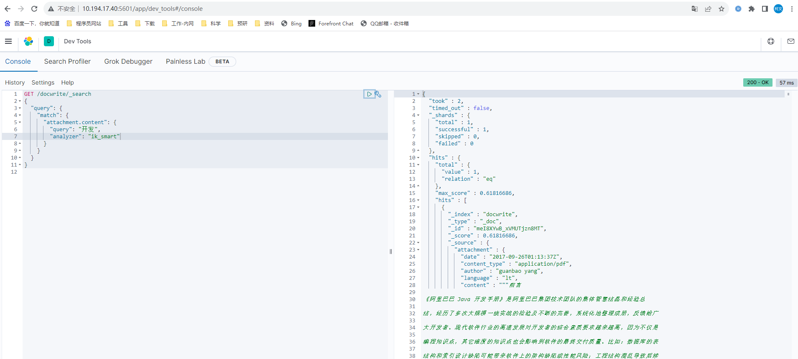

1.安装插件ingest-attachment，[点击下载]( https://artifacts.elastic.co/downloads/elasticsearch-plugins/ingest-attachment/ingest-attachment-7.9.3.zip.)

```sh
bin/elasticsearch-plugin install file:///data/ingest-attachment-7.9.0.zip
```

2.定义文本抽取管道，对入库文档的指定字段作为文档文件进行文本抽取


```

PUT /_ingest/pipeline/attachment
{
  "description": "Extract attachment information",
  "processors": [
    {
      "attachment": {
        "field": "content",
        "ignore_missing": true
      }
    },
    {
      "remove": {
        "field": "content"
      }
    }
  ]
}
```

返回报错

```
{
  "error" : {
    "root_cause" : [
      {
        "type" : "parse_exception",
        "reason" : "No processor type exists with name [attachment]",
        "processor_type" : "attachment"
      }
    ],
    "type" : "parse_exception",
    "reason" : "No processor type exists with name [attachment]",
    "processor_type" : "attachment"
  },
  "status" : 400
}
```

看来是插件没生效，安装插件后es没有重启，重启一下试试，好了

```
{
  "acknowledged" : true
}

```

3.安装分词插件，[下载地址](https://github.com/medcl/elasticsearch-analysis-ik/releases?page=8)，跟上面一样安装，安装后重启

4.建立文档结构映射

```bash
PUT /docwrite
{
  "mappings": {
    "properties": {
      "id":{
        "type": "keyword"
      },
      "name":{
        "type": "text",
        "analyzer": "ik_max_word"
      },
      "type":{
        "type": "keyword"
      },
      "attachment": {
        "properties": {
          "content":{
            "type": "text",
            "analyzer": "ik_smart"
          }
        }
      }
    }
  }
}
```

成功后返回

```
{
  "acknowledged" : true,
  "shards_acknowledged" : true,
  "index" : "docwrite"
}
```

6.上传文档，content填在[网站](https://www.toolfk.com/tools/pdf-to-base64.html)将pdf转化为base64编码后的值

```
POST /docwrite/_doc?pipeline=attachment
{
  "name":"阿里巴巴Java开发手册终极版v1.3.0",
  "type":"pdf",
  "content":""
}
```

返回结果

```
{
  "_index" : "docwrite",
  "_type" : "_doc",
  "_id" : "meI8XYwB_xVMUTjzn8MT",
  "_version" : 1,
  "result" : "created",
  "_shards" : {
    "total" : 2,
    "successful" : 1,
    "failed" : 0
  },
  "_seq_no" : 0,
  "_primary_term" : 1
}

```

查询下,可以看到文档上传成功了


按关键字查询

```
GET /docwrite/_search
{
  "highlight": {
    "fields": {"attachment.content": {
      "pre_tags": ["<em>"],
        "post_tags": ["</em>"]
    }}
  }, 
  "query": {
    
    "match": {
    
      "attachment.content": {
        "query": "微服务",
        "analyzer": "ik_smart"
      }
    }
  }
}
```



