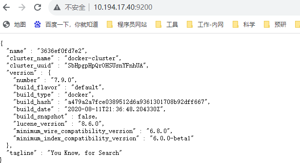
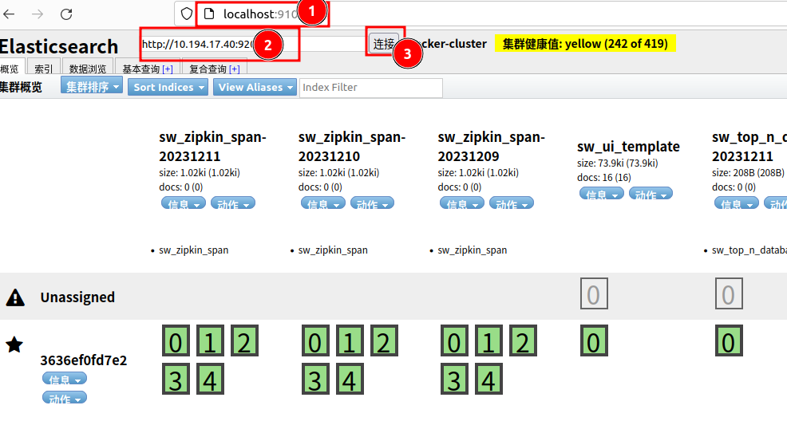
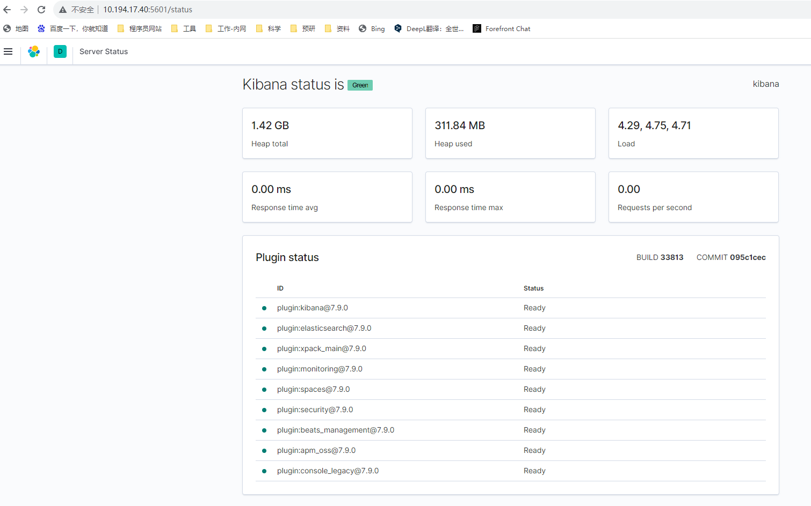

#### 背景

在之前，领导安排了一个搭建文件管理系统的任务给同事，以支持全文检索功能，主要用于管理项目交付相关的文档。然而，由于时间紧迫，同事无法同时处理这项任务。另外，我之前负责带头设计、开发和改造公司几个产品，将它们从 Spring Boot 项目迁移到微服务架构。在这个过程中，一直存在着日志监控的问题。因此，对 ELK 解决方案产生了浓厚的兴趣。因此，我主动接下了这个任务，接下来先研究一下这个开源组件吧。

#### 环境搭建

因为之前一直在使用 Docker 进行项目的安装和部署，对于定制化程度不高的软件来说，在网上找到镜像就可以轻松地运行起来，这非常方便。考虑到现阶段主要关注的是如何快速启动，而不是深入研究各个细节，我秉持着“怎么方便怎么来”的原则，先行动起来。

##### elasticsearch

###### [简介](https://www.elastic.co/guide/en/elasticsearch/reference/current/elasticsearch-intro.html)

1. 是一个分布式、免费和开放的搜索和分析引擎

   > Elasticsearch is the distributed search and analytics engine at the heart of the Elastic Stack. 

2. 适用于所有类型的数据，包括文本、数字、地理空间、结构化和非结构化数据。

   > Whether you have structured or unstructured text, numerical data, or geospatial data, Elasticsearch can efficiently store and index it in a way that supports fast searches.

3. 使用java编写，基于Apache Lucene的搜索引擎

   

###### 安装步骤

​	拉取镜像

> docker pull elasticsearch:7.9.0

​	启动

> docker run -d --name es -p 9200:9200 -p 9300:9300 elasticsearch:7.9.0
>
> 9200是对外提供的http服务端口
>
> 9300是集群内部节点间通讯端口

​	修改配置

```
cluster.name: "docker-cluster"
network.host: 0.0.0.0
#以下为新增配置 主要是跨域访问的配置和集群配置 
http.cors.enabled: true
http.cors.allow-origin: "*"
# minimum_master_nodes need to be explicitly set when bound on a public IP
# set to 1 to allow single node clusters
# Details: https://github.com/elastic/elasticsearch/pull/17288
#因为需要使用elastic-head,所以开启集群配置
discovery.zen.minimum_master_nodes: 1

```

​	验证

> 修改完配置后重启es容器，稍等片刻，使用浏览器访问安装机器的9200端口，出现es相关信息就说明启动成功了



##### elasticsearch-head

###### 简介

Elasticsearch Head 是一个用于 Elasticsearch 集群管理和监控的 Web 界面插件。它提供了一个直观的用户界面，可以帮助用户轻松地监视集群的健康状况、索引的状态、节点的信息等。通过 Elasticsearch Head，用户可以方便地查看和管理集群中的数据、索引和节点，并进行一些基本的管理操作。这个插件通常以浏览器插件的形式存在，可以直接在浏览器中使用，而无需额外的安装步骤。

Elasticsearch Head 的直观界面和丰富功能使得用户可以更加方便地监控和管理其 Elasticsearch 集群，有助于提高集群的稳定性和性能。

###### 安装步骤

作为插件主要有浏览器插件、es插件、单独进程这三种方式运行，如果以单独进程安装，那么应该还是可以以docker的方式进行。

​	拉取镜像

> docker pull mobz/elasticsearch-head:5

​	启动

> docker run -d --name es_admin -p 9100:9100 mobz/elasticsearch-head:5

​	验证

> 使用浏览器访问9100端口，可以看到如下界面，即安装成功



**如果出现文档内容不显示，http请求报错，修改配置文件解决**

> 进入head插件安装目录 ，编辑/usr/src/app/_site/vendor.js;修改共有两处
>
> 第6886行 : contentType: "application/x-www-form-urlencoded改为 contentType: “application/json;charset=UTF-8”
>
> 第7573行: var inspectData = s.contentType === “application/x-www-form-urlencoded” &&改为 var inspectData = s.contentType === “application/json;charset=UTF-8

##### kibana

###### 简介

Kibana 是一个开源的数据可视化工具，通常与 Elasticsearch 一起使用，用于分析、搜索和交互式地浏览存储在 Elasticsearch 中的数据。Kibana 提供了丰富的图表、表格、地图等可视化组件，用户可以利用这些组件来创建仪表盘、报表和实时数据监控界面。除了数据可视化外，Kibana 还提供了强大的搜索功能和数据分析工具，帮助用户更好地理解和利用其数据。

通过 Kibana，用户可以轻松地构建各种数据可视化界面，从而更直观地理解数据、发现数据中的模式和趋势，并进行实时的数据监控和分析。Kibana 的灵活性和丰富的功能使其成为了许多企业和组织在数据分析和可视化方面的首选工具。

###### 安装步骤

拉取镜像

> docker pull kibana:7.9.0

启动

> docker run --name kibana -e ELASTICSEARCH_HOSTS=http://10.194.17.40:9200 -p 5601:5601 -d kibana:7.9.0
>
> 5601是页面访问端口

验证

> 使用浏览器访问5601端口

