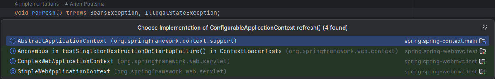
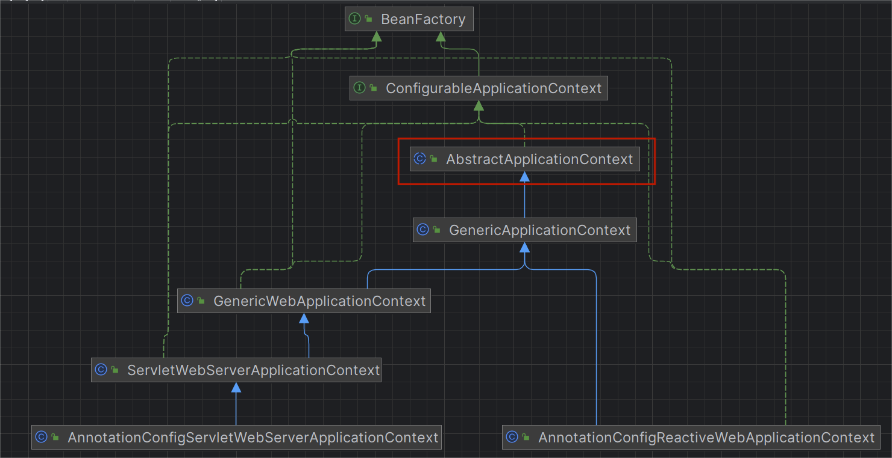

### 前言
上一篇我们了解了springboot启动的基本流程，但是留下了一些疑问，其中有个重要的方法refresh()今天我们重点针对性的分析一下，让我们先看一下refresh的定义，从注释可以看出这里一直在强调**单例对象的创建**，那我们上一篇文章留下的问题看来今天可以得到答案了

```java
	/**
	 * Load or refresh the persistent representation of the configuration, which
	 * might be from Java-based configuration, an XML file, a properties file, a
	 * relational database schema, or some other format.
	 *
	 * 从java配置类、xml文件、properties配置文件、数据库或者其他格式中加载或刷新配置的持久化
	 *
	 * <p>As this is a startup method, it should destroy already created singletons
	 * if it fails, to avoid dangling resources. In other words, after invocation
	 * of this method, either all or no singletons at all should be instantiated.
	 *
	 * 这个方法在启动的时候调用，所以如果失败了需要销毁已经创建的单例对象，
	 *
	 * @throws BeansException if the bean factory could not be initialized
	 * @throws IllegalStateException if already initialized and multiple refresh
	 * attempts are not supported
	 */
	void refresh() throws BeansException, IllegalStateException;
```



结合UML类图看一下内部关系



让我们把重心放到AbstractApplicationContext这个类的实现上来，除了ComplexWebApplicationContext和SimpleWebApplicationContext外，所有其他web容器都会调用这里的refresh方法来完成容器的初始化。

```
public void refresh() throws BeansException, IllegalStateException {
    synchronized (this.startupShutdownMonitor) {
       // Prepare this context for refreshing.
       //在springboot中 比如是servlet容器,实际上先调用该类的子类AnnotationConfigServletWebApplicationContext.prepareRefresh方法
       //这里面多做了一步ClassPathBeanDefinitionScanner.clearCache,先清空Map<Resource, MetadataReader> metadataReaderCache里的资源元数据，然后再调用这里的prepareRefresh
       prepareRefresh();

       // Tell the subclass to refresh the internal bean factory.
       //ConfigurableListableBeanFactory类实现对工厂的配置以及对bean属性的自动装配
       //获取刷新后的工厂类
       ConfigurableListableBeanFactory beanFactory = obtainFreshBeanFactory();

       // Prepare the bean factory for use in this context.
       prepareBeanFactory(beanFactory);

       try {
          // Allows post-processing of the bean factory in context subclasses.
          //添加BeanPostProcessor-ServletContextAwareProcessor @see GenericWebApplicationContext#postProcessBeanFactory
          //添加BeanPostProcessor-WebApplicationContextServletContextAwareProcessor @see ServletWebServerApplicationContext#postProcessBeanFactory
          //注册scope到容器 @see RequestScope  SessionScope
          postProcessBeanFactory(beanFactory);

          // Invoke factory processors registered as beans in the context.
          //BeanFactoryPostProcessor接口是Spring初始化BeanFactory时对外暴露的扩展点，BeanFactoryPostProcessor可以在容器实例化任何bean之前读取或修改bean的定义
          //todo 方法较长 放到下一篇介绍
          // 本着循序渐进 由浅到深的原则 先跳过这个方法 @see PostProcessorRegistrationDelegate#invokeBeanFactoryPostProcessors
          // PostProcessorRegistrationDelegate是AbstractApplicationContext委托执行post processors任务的工具类
          invokeBeanFactoryPostProcessors(beanFactory);

          // Register bean processors that intercept bean creation.
          //BeanPostProcessor和BeanFactoryPostProcessor是有区别的 别搞混了，这个是对bean实例的扩展点，上面是bean定义的扩展点，作用于bean生命周期的不同时机
          //注册BeanPostProcessor到beanFactory
          registerBeanPostProcessors(beanFactory);

          // Initialize message source for this context.
          //初始化国际化资源，如果没有则注册一个DelegatingMessageSource到容器中，并作为属性messageSource的值
          initMessageSource();

          // Initialize event multicaster for this context.
          //初始化ApplicationEventMulticaster，如果没有则注册一个SimpleApplicationEventMulticaster实例到容器中，并作为属性applicationEventMulticaster的值
          initApplicationEventMulticaster();

          // Initialize other special beans in specific context subclasses.
          //默认是个空方法，所以是为了提高扩展性设计的，留了个口子供子类实现
          //比如@see GenericWebApplicationContext#onRefresh 初始化了web项目的UI主题 前后端分离基本可以不用关心这个了
          //比如@see ServletWebServerApplicationContext#onRefresh 在这里创建了一个web服务器
          onRefresh();

          // Check for listener beans and register them.
          //获取所有ApplicationListener，注册所有的事件监听器
          registerListeners();

          // Instantiate all remaining (non-lazy-init) singletons.
          //准备动手，前戏已完成，现在开始实例化对象
          finishBeanFactoryInitialization(beanFactory);

          // Last step: publish corresponding event.
          finishRefresh();
       }

       catch (BeansException ex) {
          if (logger.isWarnEnabled()) {
             logger.warn("Exception encountered during context initialization - " +
                   "cancelling refresh attempt: " + ex);
          }

          // Destroy already created singletons to avoid dangling resources.
          destroyBeans();

          // Reset 'active' flag.
          cancelRefresh(ex);

          // Propagate exception to caller.
          throw ex;
       }

       finally {
          // Reset common introspection caches in Spring's core, since we
          // might not ever need metadata for singleton beans anymore...
          resetCommonCaches();
       }
    }
}
```

### 流程

#### 1.为上下文刷新做准备

```java
/**
 * AbstractApplicationContext#prepareRefresh
 *
 * Prepare this context for refreshing, setting its startup date and
 * active flag as well as performing any initialization of property sources.
 */
protected void prepareRefresh() {
    // Switch to active.
    //初始化标志位及启动时间
    this.startupDate = System.currentTimeMillis();
    this.closed.set(false);
    this.active.set(true);

    //看这些源码经常能看到这些日志打印的判断，减少在生产环境的资源消耗，同理会增加debug环境的资源消耗
    if (logger.isDebugEnabled()) {
       if (logger.isTraceEnabled()) {
          logger.trace("Refreshing " + this);
       }
       else {
          logger.debug("Refreshing " + getDisplayName());
       }
    }

    // Initialize any placeholder property sources in the context environment.

    //将enviroment.getPropertySources里的初始化资源{@see StandardEnvironment#customizePropertySources(MutablePropertySources) } StubPropertySource替换为实际的资源
    initPropertySources();

    // Validate that all properties marked as required are resolvable:校验参数-不能为null
    // see ConfigurablePropertyResolver#setRequiredProperties
    getEnvironment().validateRequiredProperties();

    ...
}
```

#### 2.获取单例对象工厂类

```
/**
 * AbstractApplicationContext#obtainFreshBeanFactory
 
 * Tell the subclass to refresh the internal bean factory.
 * @return the fresh BeanFactory instance
 * @see #refreshBeanFactory()
 * @see #getBeanFactory()
 */
protected ConfigurableListableBeanFactory obtainFreshBeanFactory() {
    //抽象方法，子类去实现@see GenericApplicationContext#refreshBeanFactory()
    refreshBeanFactory();
    //获取工厂类实例 @see GenericApplicationContext#GenericApplicationContext()
    //默认实现返回的是@see DefaultListableBeanFactory
    return getBeanFactory();
}
```

```
/**
 * GenericApplicationContext#refreshBeanFactory
 *
 * Do nothing: We hold a single internal BeanFactory and rely on callers
 * to register beans through our public methods (or the BeanFactory's).
 * @see #registerBeanDefinition
 */
@Override
protected final void refreshBeanFactory() throws IllegalStateException {
    //先获取锁，只允许执行一次，然后初始化id
    if (!this.refreshed.compareAndSet(false, true)) {
       throw new IllegalStateException(
             "GenericApplicationContext does not support multiple refresh attempts: just call 'refresh' once");
    }
    this.beanFactory.setSerializationId(getId());
}
```

#### 3.BeanFactory的初始化

这个方法粗略一看其实没什么内容，主要是做了一些属性的初始化，可以简单看一下里面的几个重要的属性，看起来都是在为bean的注入做准备

```
/**
	 * Configure the factory's standard context characteristics,
	 * such as the context's ClassLoader and post-processors.
	 * @param beanFactory the BeanFactory to configure
	 */
	protected void prepareBeanFactory(ConfigurableListableBeanFactory beanFactory) {
		// Tell the internal bean factory to use the context's class loader etc.

		//设置bean的类加载器
		// 默认 ClassUtils.getDefaultClassLoader()
		beanFactory.setBeanClassLoader(getClassLoader());
		//设置默认表达式解析器
		beanFactory.setBeanExpressionResolver(new StandardBeanExpressionResolver(beanFactory.getBeanClassLoader()));
		//注册默认PropertyEditor，用于依赖注入时对参数的解析转换
		beanFactory.addPropertyEditorRegistrar(new ResourceEditorRegistrar(this, getEnvironment()));

		// Configure the bean factory with context callbacks.
		beanFactory.addBeanPostProcessor(new ApplicationContextAwareProcessor(this));
		//ConfigurableListableBeanFactory#ignoreDependencyInterface
		//设置忽略自动装配的接口
		beanFactory.ignoreDependencyInterface(EnvironmentAware.class);
		beanFactory.ignoreDependencyInterface(EmbeddedValueResolverAware.class);
		beanFactory.ignoreDependencyInterface(ResourceLoaderAware.class);
		beanFactory.ignoreDependencyInterface(ApplicationEventPublisherAware.class);
		beanFactory.ignoreDependencyInterface(MessageSourceAware.class);
		beanFactory.ignoreDependencyInterface(ApplicationContextAware.class);

		// BeanFactory interface not registered as resolvable type in a plain factory.
		// MessageSource registered (and found for autowiring) as a bean.
		//@see ConfigurableListableBeanFactory#registerResolvableDependency
		//注册可以自动解析注入的类，当一个接口有多个实现类时，可以通过这个方法明确注入哪个类
		beanFactory.registerResolvableDependency(BeanFactory.class, beanFactory);
		beanFactory.registerResolvableDependency(ResourceLoader.class, this);
		beanFactory.registerResolvableDependency(ApplicationEventPublisher.class, this);
		beanFactory.registerResolvableDependency(ApplicationContext.class, this);

		// Register early post-processor for detecting inner beans as ApplicationListeners.
		//设置BeanPostProcessor-ApplicationListenerDetector
		beanFactory.addBeanPostProcessor(new ApplicationListenerDetector(this));

		// Detect a LoadTimeWeaver and prepare for weaving, if found.
		if (beanFactory.containsBean(LOAD_TIME_WEAVER_BEAN_NAME)) {
			beanFactory.addBeanPostProcessor(new LoadTimeWeaverAwareProcessor(beanFactory));
			// Set a temporary ClassLoader for type matching.
			beanFactory.setTempClassLoader(new ContextTypeMatchClassLoader(beanFactory.getBeanClassLoader()));
		}

		// Register default environment beans.
		//注册一些基本的bean
		if (!beanFactory.containsLocalBean(ENVIRONMENT_BEAN_NAME)) {
			beanFactory.registerSingleton(ENVIRONMENT_BEAN_NAME, getEnvironment());
		}
		if (!beanFactory.containsLocalBean(SYSTEM_PROPERTIES_BEAN_NAME)) {
			beanFactory.registerSingleton(SYSTEM_PROPERTIES_BEAN_NAME, getEnvironment().getSystemProperties());
		}
		if (!beanFactory.containsLocalBean(SYSTEM_ENVIRONMENT_BEAN_NAME)) {
			beanFactory.registerSingleton(SYSTEM_ENVIRONMENT_BEAN_NAME, getEnvironment().getSystemEnvironment());
		}
	}
```

#### 4.注册子类自定义的BeanPostProcess

####  5.实例化并调用所有已注册的BeanFactoryPostProcessor bean

#### 6.注册BeanPostProcessor到beanFactory

#### 7.初始化国际化资源

#### 8.初始化ApplicationEventMulticaster

#### 9.调用onRefresh()

AbstractApplicationContext里只是一个空方法，留了个口子供子类进行扩展，比如这是ServletWebServerApplicationContext的实现

```java
/**
 *ServletWebServerApplicationContext#onRefresh
 *
 */
protected void onRefresh() {
    super.onRefresh();
    try {
       //字面意思 创建web服务器
       createWebServer();
    }
    catch (Throwable ex) {
       throw new ApplicationContextException("Unable to start web server", ex);
    }
}

/**
	 * 创建服务器 并更新配置资源
	 */
	private void createWebServer() {
		WebServer webServer = this.webServer;
		ServletContext servletContext = getServletContext();
		if (webServer == null && servletContext == null) {
			//根据定义的工厂类生成web服务器，后面贴了一段工厂类配置示例
            //todo tomcat容器怎么启动、运行、销毁的 后面再分析 先欠着
			ServletWebServerFactory factory = getWebServerFactory();
			this.webServer = factory.getWebServer(getSelfInitializer());
			getBeanFactory().registerSingleton("webServerGracefulShutdown",
					new WebServerGracefulShutdownLifecycle(this.webServer));
			getBeanFactory().registerSingleton("webServerStartStop",
					new WebServerStartStopLifecycle(this, this.webServer));
		}
		else if (servletContext != null) {
			try {
				getSelfInitializer().onStartup(servletContext);
			}
			catch (ServletException ex) {
				throw new ApplicationContextException("Cannot initialize servlet context", ex);
			}
		}
		initPropertySources();
	}
	
/**
 *
 *配置示例
 */
@Bean
    public ConfigurableServletWebServerFactory webServerFactory() {
        TomcatServletWebServerFactory tomcat = new TomcatServletWebServerFactory() {
            public void postProcessContext(Context context) {
                SecurityConstraint securityConstraint = new SecurityConstraint();
                securityConstraint.setUserConstraint("CONFIDENTIAL");
                SecurityCollection collection = new SecurityCollection();
                collection.addPattern("/*");
                collection.addMethod("HEAD");
                collection.addMethod("OPTIONS");
                collection.addMethod("TRACE");
                collection.addMethod("COPY");
                collection.addMethod("SEARCH");
                collection.addMethod("PROPFIND");
                securityConstraint.addCollection(collection);
                context.addConstraint(securityConstraint);
            }
        };
        tomcat.addConnectorCustomizers(new TomcatConnectorCustomizer[]{(connector) -> {
            connector.setAllowTrace(true);
            connector.setProperty("relaxedQueryChars", "|{}[]\\");
        }});
        return tomcat;
    }
```

#### 10.注册时间监听器

#### 11.开始初始化bean

```
/**
 * Finish the initialization of this context's bean factory,
 * initializing all remaining singleton beans.
 */
protected void finishBeanFactoryInitialization(ConfigurableListableBeanFactory beanFactory) {
    ......

    // Allow for caching all bean definition metadata, not expecting further changes.
    //即将进行初始化实例，加上标志 不允许修改bean定义
    beanFactory.freezeConfiguration();

    // Instantiate all remaining (non-lazy-init) singletons.
    //todo 这个也值得单独深入研究一下
    beanFactory.preInstantiateSingletons();
}
```

#### 12.完成contextRefresh

```
/**
 * Finish the refresh of this context, invoking the LifecycleProcessor's
 * onRefresh() method and publishing the
 * {@link org.springframework.context.event.ContextRefreshedEvent}.
 */
protected void finishRefresh() {
    // Clear context-level resource caches (such as ASM metadata from scanning).
    //清楚resource缓存
    clearResourceCaches();

    // Initialize lifecycle processor for this context.
    //从容器中获取lifecycleProcessor到上下文
    initLifecycleProcessor();

    // Propagate refresh to lifecycle processor first.
    getLifecycleProcessor().onRefresh();

    // Publish the final event.
    //发布容器刷新完成事件
    publishEvent(new ContextRefreshedEvent(this));

    // Participate in LiveBeansView MBean, if active.
    LiveBeansView.registerApplicationContext(this);
}
```

### 异常处理

到这里上下文刷新完成了，但是还要处理一下异常，如果创建bean失败了怎么办

> ​	销毁所有已经创建好的bean
>
> ​	修改标志位（prepareRefresh里设置的）